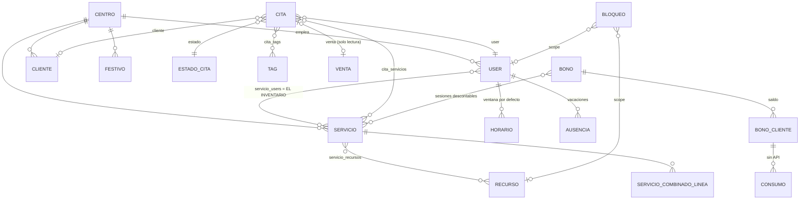

# Agenda · Ingeniería inversa de Koibox y modelo para el TPV de Mi Piace

> **Qué es esto.** Koibox es un modelo de agenda ampliamente aceptado en el sector belleza y lo
> llevamos desde el 7-ago-2026 desmontando pieza a pieza contra una cuenta real de producción
> (centro 1288, Spa Raquel Torres, plan Platinum). Este documento reconstruye **cómo funciona por
> dentro**, separa **lo que hay que copiar** de **lo que hay que arreglar**, y traduce ambas cosas a
> requisitos para la agenda de **mipiacetpv**.
>
> **Qué NO es.** No es la referencia de la API de Koibox (eso vive en las notas de proyecto y en
> `rt-booking/docs/`), ni sustituye a `SPEC_MODULO_AGENDA_HOLDED.md` (2-jul-2026), que es el diseño
> de nuestro módulo. Este documento es el **delta**: lo que dos meses de campo le añaden y le
> corrigen a aquel diseño, escrito antes de tocar la API real.
>
> **Cómo está montado.** Partes 1-3: qué hace Koibox por dentro (incluido su esquema de BD
> inferido, §1.8), qué se copia y qué se mejora. Partes 4-6: los deltas sobre el SPEC, los
> invariantes como tests y lo que sigue sin saberse. Partes 7-8: la auditoría UX/UI y el plan de
> bloques, contra la metodología y el sistema visual de Mi Piace. **Parte 9: la API que YA existe
> entre WordPress y el CRM** —el único contrato de reservas vivo, y la plantilla del adaptador del
> TPV—. **Parte 10: qué falta antes de lanzar y cómo se resuelve cada hueco.**
>
> **Fecha:** 2-sep-2026 · **Origen:** proyecto Raquel Torres Spa · **Destino:** vertical agenda de mipiacetpv.

## Cómo leer las marcas

| Marca | Significa |
|---|---|
| **[M]** | **Medido por nosotros** contra la cuenta real. Hay evidencia y fecha. |
| **[D]** | **Documentado o dicho por Koibox** (docs oficiales o respuesta de soporte). |
| **[H]** | **Hipótesis nuestra**, coherente con lo observado pero **sin verificar**. No construir sobre esto sin comprobarlo. |
| **[X]** | **Decisión nuestra** para el TPV. |

Regla de la casa: si una línea no lleva marca, es que sobra.

---

# PARTE 1 · El modelo de Koibox, reconstruido

## 1.1 La decisión de diseño que lo explica todo

**El hueco no es del centro: es del par (empleada × servicio).** **[M][D]**

Todo lo demás se deduce de ahí. `GET /api/agenda/horas-disponibles/` devuelve una lista de
`{ user, hora }` **[D]** — cada hueco viene firmado por la empleada que lo puede servir. No existe
en el modelo la idea de «a las 12:00 el centro tiene sitio»; existe «a las 12:00 Andrea puede
hacerte este servicio».

Esto es **correcto para servicios personales** y es la primera cosa que copiamos. Un spa no vende
capacidad fungible: vende a una persona con unas manos y unas competencias.

La prueba más cara de que es así: durante dos semanas la API devolvía **200 OK y cero huecos** para
44 de 45 servicios mapeados. La causa no era ningún flag, ni el widget, ni la casilla «Online»: era
que esos 44 servicios **no tenían ninguna empleada asignada** **[M, 1-sep]**. Correlación perfecta,
45 de 45: el único servicio con empleadas (96414, con 8) era el único que devolvía huecos. Koibox lo
confirmó por ticket: *«para determinar si el empleado puede realizar ese servicio miramos el campo
`servicio.users`»* **[D, #10770]**.

Sin matriz servicio×empleada no hay agenda. No es un dato de configuración: **es el inventario**.

## 1.2 El motor de disponibilidad, reconstruido

```
huecos(servicio, fecha) =
    para cada empleada E en servicio.users:                    [D] confirmado por soporte
        ventana(E, fecha)                                      [M] horario de la ficha de empleada
      ∩ horario_del_centro(fecha)                              [M] recorta por arriba
      ∩ ¬festivos_del_centro(fecha)                            [M] 8-sep-2026 → 0 huecos
      ∩ ¬citas_ocupadas(E, fecha)                              [M] agujeros reales el 28-ago
      ∩ ¬bloqueos(E | centro | recurso)                        [D] recurso /blocks, sin verificar
      discretizado en la retícula de 15 min                    [M] «Intervalos» en Ajustes → Citas online
      recortado por el plazo mínimo de reserva (1 h)           [H] el ajuste existe [M]; que la API lo aplique, sin verificar
```

Verificaciones que sostienen la ecuación **[M]**:

- El **horario del centro recorta al de la empleada**: el 1-sep el primer hueco es 09:30 (solo lo
  abre Yantina) y el último 21:30, aunque Irene y Raquel figuren en ficha hasta las 22:30.
- Los huecos **respetan la ocupación real**: el 28-ago salieron con agujeros exactos donde había
  citas (faltaban 10:45-11:45, 13:45-15:15, 20:45-21:15).
- **Anular una cita devuelve el hueco**: los 48 huecos de presoterapia volvieron al pasar la cita
  46433154 a «Anulada por centro» **[M, 2-sep]**.
- **`is_disponible_online` no gobierna nada aquí**: los 45 servicios lo tenían a `false`, incluido el
  que sí devolvía huecos **[M]**. No confundir con `is_citas_online`, que es del **cliente**.

### Lo que el motor NO hace

| No hace | Consecuencia |
|---|---|
| **Multi-terapeuta.** No existe «este servicio necesita K personas a la vez» **[H, muy sólida: no hay campo]** | Sinfonía de Manos (4 y 8 manos) **no es expresable**. Habría que componer K llamadas y crear K citas paralelas, sin transacción que las una. |
| **Recursos en el cálculo.** El recurso existe como entidad **[D]**, pero no está verificado que reste disponibilidad **[H]** | Se puede sobrevender el jacuzzi o la cabina. Sin comprobar. |
| **Buffers.** No hay `buffer_antes` / `buffer_despues` **[M: no aparece en el objeto servicio]** | El centro los mete **dentro de la duración**: ver §1.4. |
| **Política de negocio.** Ni franjas protegidas, ni cupos, ni antelación por tipo de servicio **[M]** | Devuelve *todo* hueco físicamente posible. El yield es problema del integrador. Ver §3.5. |
| **Rango de fechas.** Se pide **una fecha por llamada** **[D]** | Una tira de dos semanas = 14 llamadas contra un límite de frecuencia que no publican. Ver §1.7. |

### El parámetro que sí tiene, y es más listo de lo que parece

`is_solapamiento` **[D]**: *«indica si solo debe devolverse un empleado por hora»*. Por defecto
colapsa el resultado a una empleada por franja. Es la diferencia entre «enséñame el inventario» y
«enséñame lo que le voy a ofrecer a la clienta». **Copiar la idea**, con mejor nombre. **[X]**

## 1.3 El ciclo de vida de la cita

Estados observados en el CRM **[M, 2-sep]**:

```
Sin confirmación → Pendiente (2) → Realizada
                        ├──────→ Anulada por centro (3)      ← libera el hueco [M]
                        ├──────→ Anulada por el usuario
                        ├──────→ Perdida                      ← el no-show
                        └──────→ Bonificada                   ← consumida contra un bono
```

Tres cosas que están bien pensadas y se copian **[X]**:

1. **Distinguir quién cancela.** «Anulada por centro» y «Anulada por el usuario» son eventos
   distintos de negocio: uno es una incidencia nuestra, el otro alimenta la política de no-show.
2. **«Perdida» separada de «Anulada».** El plantón no es una cancelación.
3. **«Bonificada» como estado.** Es el único sitio de todo el sistema donde asoma el bono, y está en
   la cita. Ver §1.6.

Y una que es media verdad:

4. **No se borran citas.** `DELETE /api/agenda/<id>/` devuelve **405** **[M]** y su propio centro de
   ayuda lo dice por escrito: *«no es posible la eliminación de citas ya guardadas en la agenda»*
   **[D]**. El menú ACCIONES de la ficha tampoco lo ofrece **[M]**. La cita es historial y es
   contabilidad: **tienen razón en no borrar**. Donde se quedan cortos es en no ofrecer un borrado
   auditado para el error de tecleo, que en un mostrador pasa cada día.

### `origen`, campo de solo lectura, muy bien traído

La cita creada por API sale con `origen: 'api'` **[M]**. Saber por qué canal entró cada cita es la
base de cualquier análisis de la reserva online. Nosotros lo ampliamos: `WEB | MOSTRADOR | TELEFONO |
CANJE_CHEQUE | IMPORT` **[X]** — ya está en el SPEC como `Appointment.source`.

## 1.4 Servicios: donde la duración comercial y la de agenda se pisan

El objeto servicio tiene `nombre`, `referencia`, `duracion`, `precio`, `categoria`, `users`,
`is_disponible_online`, `is_tarifas` con cuatro tarifas, `productos_escandallo` y `recursos` **[D]**.

**No tiene buffers.** Y como la duración es un solo campo, el centro hace lo único que puede:
**meter la recogida dentro de la duración**. Lo descubrimos cruzando la carta con el mapeo:
**41 de 45 variantes están exactamente a +10 minutos** de lo que publica la carta **[M, 1-sep]**.
Las cuatro excepciones están aprobadas y comentadas (`jacuzzi-privado` y `pedicura-deluxe` a +0;
`presoterapia` y `diseno-cejas` no publican minutos).

Esa convención no estaba escrita en ninguna parte. Es tribal. Y tiene tres efectos feos:

- **No se puede publicar 60 y bloquear 70** sin que uno de los dos números sea mentira. Vendemos
  «100 min» y la agenda dice 110.
- **Cambiar la duración toca toda la casa**: subir `maderoterapia` de 60 a 110 min por la API afecta
  a la agenda entera del centro, no solo a la web **[M]**.
- **Un error de mapeo se hace invisible.** `spa-capilar` apuntaba a un servicio de 30 min y 35 € en
  vez de al de 120 min y 130 € **[M]**. Fue la convención +10 la que lo cazó: fue el único criterio
  automático que teníamos para detectar que el mapeo mentía.

> **[X] Para el TPV: `durationMin` + `bufferBeforeMin` + `bufferAfterMin` separados, como ya está en
> el SPEC §2.** La carta publica `durationMin`; la agenda bloquea la suma. Y un test que se cae si
> alguien vuelve a meter la recogida dentro de la duración.

**Servicios combinados** existen como entidad propia **[D]** y `POST /api/agenda/` los acepta,
*«dividiendo automáticamente por servicios»* y devolviendo un array de citas en vez de una **[D]**.
Es la respuesta de Koibox al ritual de varios pasos: no una cita con tramos, sino **N citas
hermanas sin padre**. Sin identidad común no hay forma limpia de cancelar el conjunto. **[H]**

## 1.5 Horarios, bloqueos y recursos

Tres recursos separados en la API **[D]**: horarios de empleada (solo lectura), bloqueos (CRUD, con
alcance centro / empleada / recurso) y recursos (CRUD).

La separación es correcta y se copia. Pero el campo dio un aviso que vale más que la API entera:

> ⚠️ **Lo que Koibox llama «horario» es una ventana de disponibilidad, no un turno contratado.**
> **[M, 31-ago]**
>
> Sumando los horarios de ficha salen **371 horas-persona/semana** frente a ~125 h de entrega real:
> **34 % de ocupación** en un centro que va lleno. La lectura coherente es que tres fichas están
> cargadas «de par en par» porque así se puede reservar en ellas, no porque esas personas trabajen
> doce horas. **Sirven para reservar, que es para lo que están. No sirven para medir capacidad.**

Esto es un **delta real sobre nuestro SPEC**, que hoy solo tiene `Shift`:

> **[X] Para el TPV: dos conceptos, no uno.**
> - `Shift` — turno contratado. Es de RRHH. Mide coste, cobertura y capacidad.
> - `BookableWindow` — ventana en la que esa persona acepta reservas. Es de agenda.
>
> Por defecto la ventana **deriva** del turno; se puede desviar, y **cada desviación se ve** en el
> panel. Sin esto, la ocupación de cualquier informe que emitamos es humo — nos ha pasado ya, y con
> ese número en la mano se sostenía una valoración de negocio.

**Festivos:** 14 cargados en el CRM y **sí se respetan** en el cálculo **[M]** — verificado con el
8 de septiembre (Virgen del Prado, festivo local de Talavera): 0 huecos.

## 1.6 Bonos: el agujero, y es el que más importa para un TPV

**En el CRM existen.** *Configuración → Bono → añadir servicios y/o productos junto a la cantidad de
sesiones «que se podrán realizar y descontar»* **[D]**. Es exactamente el saldo consumible que
necesita cualquier spa: el programa de 10 sesiones que se compra hoy y se gasta en seis meses.

**En la API no existen en absoluto.** Verificado por dos vías independientes **[M, 1-sep]**:

- **Barrido de la documentación:** los recursos son impuestos, provincias, caja/ventas, citas,
  clientes, webhooks, claves, productos, servicios, servicios combinados, bloqueos, horarios,
  recursos. **Ninguno de bonos.** El objeto `cliente` no trae saldo ni sesiones pendientes (solo
  `puntos_disponibles`, que es fidelización). La `cita` no admite bono ni al crear ni al actualizar.
  **Ningún webhook de bono.**
- **Sondeo real con la clave:** 13 rutas candidatas (`bonos`, `bono`, `abonos`, `sesiones`, `vales`,
  `packs`, `cliente-bonos`…), **todas 404**, con tres controles que hacen que ese 404 signifique algo
  (`api-key/me` 200, `servicios?limit=1` 200, `esto-no-existe-seguro` 404).

⚠️ **«Pack» en Koibox es otra cosa**: *«un conjunto de servicios y/o productos que se venden en el
mismo día»* **[D]**. Un lote de una visita, no un saldo.

Y encima, **`precio`, `precio_sin_descuento`, `descuento` y `venta` son de solo lectura** en la cita
**[D]**. Es decir: desde la API **no se puede descontar una sesión ni tocar el precio**.

Consecuencia, dicha sin rodeos: **en Koibox el producto que más margen deja es invisible para
cualquier integración.** Todo lo que se venda como programa hay que gestionarlo a mano en el CRM o
duplicarlo fuera. Nosotros lo estamos duplicando fuera: `wp_rt_booking_citas.programa_id` + una nota
compuesta en `observaciones` **[M]**. Es un parche declarativo — el saldo no baja solo.

> **[X] Para el TPV, esto es el diferencial, no una funcionalidad más.**
> `Program` (plantilla: N sesiones de qué servicio, precio, caducidad) · `ProgramBalance` (saldo de
> una clienta) · `ProgramConsumption` (qué cita gastó qué sesión). Crear la cita y descontar la
> sesión son **la misma transacción**. Y como el TPV es nuestro, la venta del programa, el saldo y el
> ticket de cierre son el mismo sistema — que es justo lo que Koibox no puede hacer aunque quiera,
> porque su agenda y su caja se hablan por dentro pero no por fuera.

### El corolario que ya nos mordió

**Lo que se vende no es lo que se reserva.** El producto comercial es el programa (N sesiones); la
unidad reservable es **una sesión**, indistinguible en la agenda de una cita suelta **[M, 1-sep]**.
En la carta de Raquel Torres son **29 programas en 22 fichas de 46**, y hacen falta **45 variantes
reservables para 37 servicios** porque cada duración es un producto distinto.

La traducción programa → sesión reservable tiene que ser **una función explícita y testeada**, no
una convención. La nuestra (`resolve_session`) tiene tres ramas y **se cae con mensaje** cuando es
ambigua, en vez de elegir en silencio **[M, B8]**. Eso se lleva tal cual al TPV. **[X]**

## 1.7 El contrato de la API, y sus trampas

Lo pongo aquí no como referencia, sino porque **cada trampa es una decisión de diseño que nosotros
tomaremos al revés**.

| Lo que hace Koibox | Qué nos costó | **[X] Qué haremos nosotros** |
|---|---|---|
| **El nombre de la operación en la doc NO es la ruta.** `crear-cita` → `POST /api/agenda/` **[D]** | Hasta la v0.4.1 el plugin habría comido 404 en todo | Ruta = contrato. Y la doc se genera del código. |
| ⚠️ La doc **en inglés** muestra `/api/services`, `/api/blocks`, `/api/resources` **[D]** — pero las rutas reales verificadas son en castellano (`/api/servicios/`, `/api/agenda/`) **[M]**. Las inglesas son **[H] casi seguro etiquetas traducidas que no existen** | — | Una sola lengua en las rutas. |
| **Un parámetro no reconocido se ignora en silencio** y devuelve la lista entera **[D, #10770]** | `?telefono=X` devolvía **todos** los clientes; un matcher ingenuo habría colgado **todas** las reservas de la web de una clienta real **[M]** | **400 ante parámetro desconocido.** Sin excepciones. |
| `page` se ignora en silencio; la paginación es `limit`/`offset`, máx **50** **[D]** | Acumulamos «400 servicios» que eran **20 ids repetidos 20 veces** | Igual: 400, y `next` explícito. |
| **Límite por frecuencia sin cifras publicadas**, con derecho a retirar el acceso **[D, #10622]** | Caché de 120 s + tope propio de 30/min + copia tibia de 15 min, todo a ciegas **[M]** | **429 con `X-RateLimit-*`.** Un límite que no se puede observar no se puede respetar. |
| **`hora_fin` es obligatoria y la calcula el cliente** **[D]** | Se puede reservar 15 min para un servicio de 50 | El servidor **deriva** el rango del servicio. El cliente propone `start`, nunca `end`. |
| **El PATCH de una cita exige reenviar `hora_fin`** aunque no cambie **[M]** — mientras el de servicios sí es parcial de verdad **[M]** | 400 crípticos | Coherencia: parcial es parcial. |
| **Sin sandbox. Se opera sobre la agenda real** **[D]** | Empleado de pruebas de pago (36,30 €), candado de escritura por constante en `wp-config`, y una única cita real escrita y anulada **[M]** | **Entorno de pruebas de primera clase** y `dry_run` en la API. |
| **Sin hold, sin idempotencia, sin ETag** **[M]** | Entre pedir huecos y crear la cita hay una carrera y la API no ofrece nada | Ver §3.4. |

### 🔴 El fallo de modelado más caro de todos: `notas` es un alias

`POST /api/agenda/` acepta `notas` y `observaciones` **[D]**. Parecen dos campos de la cita. **No lo
son** **[M, 2-sep]**:

| Campo | Dónde acaba de verdad |
|---|---|
| `titulo` | La tarjeta de la agenda: `[CLIENTE - móvil]: <titulo>`. Lo único legible sin abrir la cita |
| **`notas`** | **Las NOTAS DE LA FICHA DEL CLIENTE.** No es de la cita |
| `observaciones` | El cuadro «Observaciones» propio de la cita. **Aquí va la nota** |

Prueba definitiva: un `PATCH /api/clientes/1095918/` con `notas: ''` **vació también** el `notas` de
la cita 46433154, mientras `observaciones` seguía intacto. **Son el mismo campo.**

Lo dimos por supuesto en el bloque B8 y escribimos en la ficha de una clienta real. Se limpió el
mismo día, se arregló en la 0.8.1 y se puso un guardarraíl en el smoke que se cae si `notas` vuelve
a aparecer en el payload **[M]**.

> **La lección no es «cuidado con `notas`». Es que dos entidades no pueden compartir un campo con el
> mismo nombre y distinto dueño**, y que **una suposición sobre dónde escribe un campo cuesta una
> ficha de clienta**. En el TPV: la nota de la cita es de la cita, la de la ficha es de la ficha, y
> ninguna API nuestra tiene dos campos que parezcan hermanos y no lo sean. **[X]**

## 1.8 La base de datos que hay debajo, inferida

> ⚠️ **Nada de esta sección es [M].** Es **[H]**: deducción desde el contrato de la API, el
> comportamiento observado y lo que soporte ha dicho por escrito. Va aquí porque **las inferencias
> fuertes valen para diseñar** — y porque cada defecto de Koibox se explica mejor desde su esquema
> que desde su API.

### 1.8.0 El stack, que es lo primero y casi seguro

**Django + Django REST Framework**, sobre PostgreSQL o MySQL. **[H, muy alta]**

| Pista | Qué delata |
|---|---|
| Filtros `email__icontains`, `movil__in`, `fecha__gte/__lte/__gt/__lt`, `cliente__id`, `user__id`, `estado__id` **[D]** | Son **lookups literales del ORM de Django**, incluida la travesía de clave ajena por doble guion bajo |
| Respuesta `{count, next, previous, results}` con `limit`/`offset` y tope duro de **50** **[D]** | `LimitOffsetPagination` de DRF con `max_limit = 50` |
| Un parámetro desconocido **se ignora en silencio** **[D, #10770]** | Comportamiento por defecto de `DjangoFilterBackend`: lo que no está declarado, no filtra |
| Todos los booleanos con prefijo `is_` (`is_disponible_online`, `is_citas_online`, `is_agree_rgpd`, `is_solapamiento`, `is_empleado_aleatorio`) **[D]** | Convención de modelo Django |
| `DELETE` → **405** **[M]** | `ModelViewSet` al que le han quitado `destroy`, o `ReadOnly`+acciones sueltas |
| El PATCH exige reenviar `hora_fin` aunque no cambie **[M]** | Validación **de objeto completo** en `Model.clean()` / `Serializer.validate()`, no por campo |

Importa porque, si es Django, **el esquema es predecible** y se puede diseñar contra él sin verlo.

### 1.8.1 Multi-inquilino por columna, y los usuarios son globales

`centro = 1288` aparece en las rutas internas (`/main/users/?centro=1288&is_active=true`) **[M]**.
Y los ids de empleado del centro son **4287-4294**, **30645** y **32825** **[M]** — rangos
separadísimos, con el empleado de pruebas creado en septiembre a 32825. Eso no es una tabla por
centro: es **una tabla global de usuarios** con un `centro_id`.

Lo confirma el modelo de negocio: la plaza de empleado adicional **se factura por asiento**
(36,30 €/año) **[M, #10751]**. Se cobra por fila.

→ `centro_id` en prácticamente todas las tablas, y la clave API resolviendo a un centro. **[H, alta]**

### 1.8.2 El esquema reconstruido



Tablas deducidas, con la evidencia de cada una:

| Tabla | Columnas que sabemos que tiene | Evidencia |
|---|---|---|
| `user` (empleada **y** usuario del sistema, la misma) | id, nombre, username/email, is_active, centro | **[M]** ids leídos del `users` de `/api/servicios/96414/` |
| `cliente` | id, created, updated, nombre, apellido1, apellido2, dni, movil, fijo, email, direccion, localidad, provincia, codigo_postal, fecha_nacimiento, is_citas_online, is_agree_rgpd, categoria, **notas**, puntos_disponibles + **agregados de solo lectura** (nº de citas, fecha de la última, importe de ventas, deuda, descuentos, origen) | **[M]** campos reales + **[D]** filtros y campos de solo lectura |
| `servicio` | id, nombre, referencia, duracion (TIME), precio, categoria, is_disponible_online, is_tarifas + precio_tarifa1..4, created, updated | **[D]** |
| **`servicio_users` (M:N)** | servicio_id, user_id | **[D, #10770]** *«miramos el campo `servicio.users`»*. **Es el inventario** |
| `servicio_recursos` (M:N) | servicio_id, recurso_kind/id, qty | **[D]** campo `recursos` en el servicio |
| `servicio_combinado` + líneas | — | **[D]** recurso propio, y `POST /api/agenda/` los divide en N citas |
| `cita` | id, created, updated, titulo, **fecha** (DATE), **hora_inicio** (TIME), **hora_fin** (TIME), duracion, user_id, cliente_id, observaciones, is_empleado_aleatorio, is_cliente_en_centro, estado_id, origen, precio, precio_sin_descuento, descuento, venta_id, **y un estado de notificación por canal: SMS, email, push, WhatsApp** | **[D]** + **[M]** |
| `cita_servicios` (M:N) | — | **[D]** `servicios` acepta array |
| `estado_cita` (catálogo) | id, nombre. **Pendiente = 2, Anulada por centro = 3**; 7 estados | **[M]** |
| `tag` + `cita_tags` | — | **[D]** |
| `horario` (por empleada) | user_id, día, tramos | **[M]** ficha → HORARIO / VACACIONES → «Horario por defecto» |
| `ausencia` | — | **[M]** la pestaña se llama HORARIO / **VACACIONES** |
| `bloqueo` | scope (centro/empleada/recurso), rango, motivo, recurrencia | **[D]** recurso propio con CRUD |
| `festivo` | centro_id, fecha | **[M]** 14 cargados, y el 8-sep devuelve 0 huecos |
| `venta` + líneas | filtra por `cliente__id` y `cita__id`; **el esquema publicado no muestra las líneas** | **[D]** |
| **`bono`** + `bono_servicios` + `bono_cliente` (saldo) + consumo | Existen en el CRM con sesiones descontables. **Cero serializers** | **[M] + [D]** §1.6 |
| `webhook`, `api_key`, plantillas de email/WhatsApp | — | **[D]** + **[M]** las 7 plantillas auditadas |

### 1.8.3 Las cinco pistas que más dicen, y lo que cada una nos enseña

**1 · `notas` es un alias ⇒ la cita no tiene columna de notas.** **[H, muy alta]**
Vaciar `cliente.notas` por PATCH vació también el `notas` de la cita **[M]**. La lectura limpia es
un `source='cliente.notas'` de DRF, con escritura incluida. Es decir: el panel «Notas del cliente»
que se ve *dentro* de la ficha de la cita es **una vista de la ficha del cliente**, y alguien lo
publicó en la API como si fuera un campo de la cita.
→ *Un campo de la interfaz no es un campo del modelo. Al exponerlo, se decide cuál es cuál.*

**2 · La cita guarda `fecha` + `hora_inicio` + `hora_fin` como tres columnas sueltas, no un rango.**
**[H, alta]** Lo delatan que `hora_fin` sea obligatoria, que el PATCH la exija aunque no cambie
(validación de objeto completo) y el texto del 400: *«La hora de fin es obligatoria en citas sin
servicios combinados»* **[M]**.
→ **Con tres columnas sueltas no se puede poner una restricción de exclusión.** El solape solo se
puede evitar en código de aplicación, y eso explica de una vez que no haya *hold*, ni idempotencia,
ni ETag, y que la carrera entre consultar y reservar sea problema del integrador. Nosotros hacemos
lo contrario: `tstzrange` + `EXCLUDE USING gist`. §3.4

**3 · La duración sí se deriva… pero solo en el camino de servicios combinados.** **[H, media]**
El mensaje de error acota la obligación a las citas **sin** servicios combinados: para el combinado
el sistema calcula el final él solo.
→ La lógica existe y no la aplican al caso normal. Es deuda, no imposibilidad. En el TPV, `hora_fin`
la deriva **siempre** el servidor.

**4 · El cliente lleva contadores denormalizados** (nº de citas, última cita, importe de ventas,
deuda, descuentos, puntos), todos de solo lectura **[D]**.
→ Se mantienen por señales al guardar cita y venta. Es la decisión **correcta** para que el listado
de clientes vaya rápido, y la razón por la que esos campos no se pueden escribir. Se copia. **[X]**

**5 · Dos prefijos de ruta = dos capas, y esta es la pista madre.** **[H, alta]**
Conviven `/api/...` con clave (público) y `/main/users/`, `/agenda/citas/feed/` con **sesión de
navegador** (interno del CRM) **[M]**.
→ **La API pública es una capa de serializers añadida después sobre una aplicación que ya existía**,
no la interfaz nativa del producto. Eso explica de golpe casi todo lo que hemos sufrido: recursos
que faltan (bonos), campos de precio de solo lectura, el alias de `notas`, cero transaccionalidad, y
que su propia documentación llame a las operaciones por su **nombre interno** en vez de por su ruta.

> **[X] La lección para mipiacetpv, y es la más cara de aprender tarde: la API no se pone encima al
> final.** Si la agenda no se construye contra su propio contrato desde el primer día —el panel
> interno consumiendo lo mismo que consume la web— acabaremos con el mismo escalón: una interfaz
> completa y una API que solo sabe contar la mitad.

### 1.8.4 Lo que no se puede saber desde fuera

Índices y claves · tipos exactos · si hay borrado lógico (el 405 lo sugiere, pero puede ser
simplemente un `destroy` ausente) · el esquema de bonos entero · si `estado_cita` es catálogo global
o por centro · si `recurso` entra de verdad en el cálculo de disponibilidad · el motor de base de
datos (PostgreSQL es lo probable, no está demostrado).

### 1.8.5 Cómo se comprobaría, y es barato

Cuatro sondas de lectura, ninguna escribe nada. **Ninguna se ha hecho todavía.**

1. **`OPTIONS` sobre cada colección.** DRF suele devolver el esquema de campos con tipo, obligatoriedad
   y `choices`. **Es lo más rentable de la lista con diferencia** y sale casi el esquema entero.
2. **`GET /api/agenda/<id>/` completo**, mirando qué viene anidado y qué viene por id: eso separa
   clave ajena de M:N sin adivinar.
3. **Un `PATCH` con un campo inventado**: si lo ignora, el serializer es laxo; si da 400, es estricto.
4. **Provocar un 400 a propósito** en cada recurso: los mensajes de Django delatan nombres de campo y
   validadores, como ya nos pasó con `hora_fin`.

---

# PARTE 2 · Lo que copiamos

Sin ironía: Koibox acierta en lo estructural. Estas ocho decisiones son buenas y las heredamos.

1. **El hueco es del par (empleada × servicio).** §1.1
2. **La matriz servicio×empleada es el inventario**, no configuración. Si nadie sabe hacerlo, no se
   ofrece. Y con un panel que lo diga en la cara: «44 de 45 servicios no tienen a nadie asignado» es
   un aviso, no un misterio de dos semanas.
3. **Retícula configurable** (15 min) **separada de la duración** del servicio.
4. **Horario del centro como techo** sobre el de cada persona, y **festivos como capa aparte**.
5. **Estados de cita ricos**, distinguiendo quién cancela y separando el no-show.
6. **Anular libera, no borra.** La cita es historial y contabilidad.
7. **La agenda no cobra.** `precio`/`venta` de solo lectura desde la cita es lo correcto: la agenda
   genera demanda, el TPV cierra caja. Esa frontera es sana y en nuestro caso es literal.
8. **`origen` del registro** y **webhooks de cita/cliente/venta** como base de sincronización.

---

# PARTE 3 · Lo que mejoramos, y por qué se vende

Cada punto es una carencia **medida** de Koibox, no una opinión.

## 3.1 Buffers explícitos
`durationMin` + `bufferBefore/After`. Publicamos 100 y bloqueamos 110 sin mentir en ninguno de los
dos sitios. **Hoy no se puede.** §1.4

## 3.2 Multi-terapeuta y recursos nativos
`staffRequired = K` con matching de K personas simultáneas, y `ServiceResourceNeed` restando de
verdad. Sinfonía de Manos es un producto real del catálogo que **hoy no es reservable online**. Con
K≤4 y plantilla de 8, fuerza bruta sobra. Ya está diseñado en el SPEC §3.

## 3.3 Programas y bonos de primera clase
El agujero de §1.6. Saldo, consumo transaccional, caducidad, y venta enlazada al ticket. **Es el
diferencial comercial del módulo**, no un extra.

## 3.4 Integridad por base de datos, no por buena voluntad
Koibox no ofrece hold, ni idempotencia, ni forma de resolver la carrera entre consultar y reservar.
Nosotros:

- `EXCLUDE USING gist (staff_id WITH =, timeslot WITH &&)` en Postgres — el solape es **físicamente
  imposible**, no «improbable». SPEC §4.
- **Escritura anticipada**: la fila local se inserta en `pending` **antes** de llamar al motor, con
  `idempotency_key` UNIQUE. Un timeout deja una fila recuperable en vez de una cita duplicada.
  Ya construido y probado en rt-booking B1 **[M]**.
- Pre-reserva con `pendingUntil` (TTL 10 min) para la señal con Stripe.

## 3.5 La capa de políticas — lo que Koibox no tiene y el spa necesita
Koibox devuelve **todo hueco físicamente posible**. Con el catálogo abierto entero eso significa que
**el servicio barato y corto se come el sitio del caro y largo**. Los números del centro **[M]**:

- **Cuatro franjas concentran el 42,3 % del ingreso anual** (11:00, 12:00, 18:00, 19:00 = 116.837 €
  de 241.190 €).
- **51,6 % de las citas son servicio corto a 8,94 € de media**, frente al 48,4 % de tratamientos a
  **50,30 €**. Diferencia por hueco ocupado: **41,36 €**.

Nuestras cuatro reglas, ya construidas y con 400 checks verdes en rt-booking **[M]**: sábado tarde
cerrado salvo whitelist · franjas de valor protegidas por duración mínima · liberación tardía a 48 h
· **no fragmentar bloques libres**.

La cuarta es la que nadie cuenta y probablemente la que más capacidad protege. Medido el 2-sep:
presoterapia (15 min) en un día vacío, el endpoint crudo ofrece **48 huecos** y nuestra regla ofrece
**6** — pegados a los extremos de los bloques libres. Es aritmética de empaquetado, no predicción.

**Tres condiciones que hay que decir en voz alta:**
- Las reglas se aplican **al pintar la disponibilidad y también al reservar**, o basta con adivinar
  la hora y llamar al endpoint. Ya lo atamos así **[M]**.
- **La protección es parcial mientras el mostrador entre por otro sitio.** Con la regla solo en la
  web valen 4.000-10.000 €/año; con la regla en toda la casa, 19.000-30.000 €. **La diferencia no es
  tecnológica.** En nuestro TPV la casa es una sola: **ahí sí podemos aplicar la política entera**, y
  eso Koibox no lo puede ofrecer aunque quiera.
- **Nada de IA todavía.** Cero reservas online = cero datos con los que entrenar. Reglas
  deterministas, auditables, testeables y que Raquel pueda explicarle a una clienta. La capa
  predictiva irá **encima**, nunca en lugar de. ADR-001.

## 3.6 Disponibilidad por rango en una llamada
Koibox es una fecha por petición **[D]**. Una tira de dos semanas son 14 llamadas contra un límite de
frecuencia opaco; tuvimos que ponerle presupuesto de llamadas y resolver los días cerrados sin red
**[M]**. `availability(service, dateRange)` en una llamada es lo obvio.

## 3.7 Turno contratado ≠ ventana reservable
§1.5. **Delta nuevo sobre el SPEC.** Sin esto no se puede medir ocupación, y sin ocupación no hay
informe de negocio que valga.

## 3.8 Una API que no miente
400 ante parámetro desconocido · 429 con cabeceras · `hora_fin` derivada por el servidor · PATCH
parcial de verdad · sin campos alias · modo `dry_run` · entorno de pruebas. §1.7

---

# PARTE 4 · Deltas sobre `SPEC_MODULO_AGENDA_HOLDED.md`

El SPEC se escribió el 2-jul-2026, **antes** de tocar la API. Sigue en pie casi entero. Lo que hay
que cambiar:

| # | Delta | Origen |
|---|---|---|
| 1 | **Partir `Shift` en `Shift` (contratado) + `BookableWindow` (reservable)** | §1.5 — el 34 % de ocupación falso |
| 2 | **Añadir `Program` / `ProgramBalance` / `ProgramConsumption`** al modelo. No están en el SPEC | §1.6 — el agujero de los bonos |
| 3 | **`Service` gana `catalogDurationMin` además de `durationMin`** (lo que publica la carta vs lo que bloquea la agenda), con test de coherencia | §1.4 — la convención +10 |
| 4 | **`ServiceVariant` explícito**: 45 variantes para 37 servicios. La ficha no se reserva; se reserva la variante | §1.6 |
| 5 | **Corregir §7 del SPEC**: las rutas que documenta (`GET /horas-disponibles`, `POST /citas`, `PATCH /citas/:id`) **son falsas**. Las reales son `GET /api/agenda/horas-disponibles/` y `POST /api/agenda/`, y **no hay DELETE** | §1.7, §1.3 |
| 6 | **Corregir §7**: `cancel()` no es `PATCH /citas/:id` genérico — es cambiar a **estado 3** reenviando `hora_fin` | §1.3, §1.7 |
| 7 | **Añadir al §5 la capa de fragmentación.** El SPEC tenía elegibilidad pero no empaquetado, y el empaquetado protege más | §3.5 |
| 8 | **`Appointment` gana `idempotencyKey` UNIQUE y escritura anticipada `pending`** | §3.4 |
| 9 | **Los servicios combinados de Koibox generan N citas hermanas sin padre.** Nuestro `Appointment` necesita `parentId` o `groupId` | §1.4 |
| 10 | **Nota de cita ≠ nota de cliente.** Escribirlo como invariante, no como buena práctica | §1.7 |

---

# PARTE 5 · Invariantes: los tests que cualquier agenda nuestra tiene que pasar

Escritos como se caen, no como se cumplen.

1. Dos citas confirmadas de la **misma persona** no se solapan. *(Lo garantiza la BD, no el código.)*
2. Dos citas confirmadas del **mismo recurso** no se solapan.
3. Un servicio con `staffRequired = K` solo ofrece huecos donde hay **K personas compatibles libres a
   la vez**.
4. El rango bloqueado es **`buffer_antes + duracion + buffer_despues`**; el publicado en la carta es
   **`duracion`**. Nunca el mismo número.
5. Un servicio **sin ninguna persona compatible** no ofrece huecos **y el panel lo dice**.
6. Las reglas de política se aplican **igual al listar que al reservar**. Un `book()` de un hueco que
   `availability()` no ofrecía **falla**.
7. Anular **libera** el hueco. Borrar **no existe** (o es soft-delete auditado).
8. Reintentar la misma reserva con la misma `idempotency_key` **no crea una segunda cita**.
9. Consumir sesión de programa y crear cita son **atómicos**: o las dos o ninguna.
10. Un parámetro de filtro desconocido devuelve **400**, nunca la lista entera.
11. La nota de la cita **no** aparece en la ficha del cliente.
12. Cambiar la duración de un servicio **no** reescribe citas ya creadas.
13. Un festivo del centro devuelve **cero** huecos.
14. La disponibilidad se calcula en la **zona horaria del centro**, y el test se repite bajo otra TZ
    por defecto del sistema. *(Ya lo hacemos en `Policy` **[M]**.)*

---

# PARTE 6 · Lo que sigue sin saberse

Honestidad de inventario. Nada de esto está verificado:

- **¿`POST /api/agenda/` acepta `observaciones` en la creación**, o solo por PATCH posterior? La
  0.8.1 lo **asume**. Ticket **#10795 abierto el 2-sep**, sin respuesta. Es exactamente el mismo tipo
  de suposición que costó el hallazgo de `notas`.
- **¿Los recursos restan disponibilidad de verdad?** Nunca probado.
- **¿Los servicios combinados sirven para multi-terapeuta?** Sin probar, y de ello depende si
  Sinfonía de Manos se puede ofrecer en la fase Koibox.
- **¿Existen los bonos con otro nombre en la API?** 13 rutas descartadas; falta que Koibox lo
  confirme o lo niegue.
- **El esquema real de Koibox sigue siendo inferencia.** Las cuatro sondas de §1.8.5 (empezando por
  `OPTIONS` sobre cada colección) no se han lanzado. Son de lectura, no escriben nada, y `OPTIONS`
  puede devolver el esquema de campos casi entero. **Es lo más rentable que queda pendiente.**
- **¿Con qué se mide la ocupación real?** Ni las ventanas de Koibox ni las horas contratadas
  actuales sirven. Probablemente el propio histórico de citas. **Pendiente de decidir.**

---

# PARTE 7 · Auditoría UX/UI

## 7.0 Qué se audita, y con qué vara

Dos objetos distintos:

- **La interfaz de Koibox**, que hemos usado a fondo dos meses contra una cuenta real. Todos los
  hallazgos son **[M]**: incidencias que nos pasaron, con fecha, no impresiones.
- **La interfaz que vamos a construir**, especificada aquí para que se pueda implementar sin
  interpretar.

**La vara es la de casa:** los principios UX de Mi Piace (skill `metodologia-front-mipiace` §4 y
`references/principios-ux.md`) y el `sistema-visual-mipiace`. Nada de criterios nuevos.

## 7.1 Auditoría de la interfaz de Koibox · **4/10**

| Dimensión | Nota | Por qué |
|---|---|---|
| Rejilla de agenda (el núcleo) | **7** | Funciona, es densa y legible, y el modelo de estados es rico. Es lo mejor que tienen |
| Fiabilidad de la interacción | **2** | Acciones no deterministas: el mismo clic funciona o no |
| Honestidad del estado | **2** | La UI oculta datos que siguen vivos y guarda sin que se lo pidas |
| Estados vacíos y diagnóstico | **1** | El fallo más caro del proyecto era invisible en pantalla |
| Formularios y guardado | **3** | Acción primaria tapada, descarte silencioso |
| Acabado y consistencia | **4** | Widget de terceros encima del botón de enviar |

### Hallazgos, por severidad

**🔴 Críticos — cuestan datos o tiempo real**

| # | Hallazgo **[M]** | Principio Mi Piace que rompe | **[X] Regla para la nuestra** |
|---|---|---|---|
| 1 | **La UI oculta estado que sigue vivo.** Al apagar el interruptor «Online» de un servicio, el campo `users` **desaparece de la pantalla pero conserva los datos**; Koibox mismo recomienda «quitarle también los `users`» a mano **[D, #10770]** | Datos y confianza | **Lo oculto no existe.** Si un dato sigue gobernando el comportamiento, se ve. Un interruptor que esconde su causa está prohibido |
| 2 | **Ningún sitio dice que 44 de 45 servicios no tienen a nadie asignado.** Ese era el fallo, y la pantalla no lo insinuaba: costó **dos semanas de diagnóstico** | Estado vacío siempre informativo | El **panel de salud** de §7.5 es obligatorio en la v1, no un extra |
| 3 | **Las plantillas de email persisten sin pulsar GUARDAR: inyectar = publicar** | Confirmaciones | **Borrador explícito.** Nada que llegue a una clienta se guarda solo. Y previsualización antes de publicar |
| 4 | **Escape y la ✕ descartan el modal sin avisar** | Deshacer, no confirmar | Sin modales en flujo crítico. Y todo panel con cambios pendientes avisa al cerrarse |
| 5 | **El botón GUARDAR vive en una barra fija abajo a la derecha y se queda tapado si la ventana es baja** — a Matías no le salía | Acción primaria siempre alcanzable | La CTA es parte del flujo del contenido, no una barra flotante que pelea con el viewport. Verificado a **320 px** y en ventana baja |
| 6 | **Clicar una opción del desplegable «Departamento» cierra el modal y pierde el borrador** (hay que navegarlo con teclado) | Sin pérdidas silenciosas | Ningún control puede destruir el formulario que lo contiene |
| 7 | **El chat de soporte tapa el botón ENVIAR**; solo funciona clicando su mitad izquierda | Acabado | Ningún widget flotante sobre la acción primaria. Se comprueba en el screenshot, no en el CSS |

**🟠 Altos — erosionan la confianza**

| # | Hallazgo **[M]** | **[X] Regla** |
|---|---|---|
| 8 | **El menú ⋮ solo abre con clics reales y alternos, y tarda ~3 s.** Con `96465` no hubo manera en ~14 intentos | Una acción es determinista o es un bug. Feedback **<100 ms** al pulsar, siempre |
| 9 | **El modal de ticket tarda ~4 s y el primer clic parece no hacer nada** | Todo botón que dispara algo lento cambia de estado en el acto («Abriendo…», deshabilitado) |
| 10 | **El buscador se come lo primero que escribes** si la página acaba de cargar | El foco no se roba. Si la pantalla aún hidrata, el input no acepta o retiene lo tecleado |
| 11 | **«Claves API» siguió gris tras contratar Platinum hasta cerrar sesión y volver a entrar**: la sesión arrastraba permisos viejos | Un cambio de permisos invalida la sesión. Nunca «cierra y vuelve a entrar» como solución |
| 12 | **La sesión caduca sola cada poco** | Sesión larga en dispositivo de mostrador; el bloqueo es por PIN, no por logout |
| 13 | **El listado de servicios no muestra la duración junto al nombre**: por eso `spa-capilar` apuntó meses a un servicio de 30 min y 35 € en vez del de 120 min y 130 € | Todo listado enseña el dato que **desambigua**, no solo el nombre |

### Lo que Koibox hace bien y se copia

- **La rejilla de agenda** como pantalla principal: columnas por empleada, densa, legible.
- **Los estados de cita**, que distinguen quién cancela y separan el plantón. §1.3
- **El toast verde de confirmación** con el nombre de quien hizo la acción («Atención Mamen · Acción
  realizada con éxito») — que **haya un responsable en el mensaje** está bien pensado para un
  mostrador compartido. *(Pero va donde mira el usuario, no en la esquina.)*
- **La ficha del empleado → pestaña SERVICIOS** para asignar la matriz: es más rápida y menos
  peligrosa que su propia vía oficial. La adoptamos como patrón: **la matriz se edita desde los dos
  lados**, y ninguna de las dos vistas esconde el dato.

---

## 7.2 Inventario de pantallas de la vertical

Esto es el `docs/XX-front-analisis.md` de la vertical en miniatura. **Prioridad**: 🟥 v1 · 🟨 v1.1 · ⬜ fuera.

| # | Pantalla | Papel | Prio | Bloque |
|---|---|---|---|---|
| P1 | **Rejilla del día** | La pantalla. Mostrador y tablet, landscape | 🟥 | A2 |
| P2 | **Nueva cita** (panel lateral, no modal) | Crear en 3 toques desde un hueco | 🟥 | A3 |
| P3 | **Detalle de cita** (expandible inline) | Ver, mover, cambiar estado, anular | 🟥 | A3 |
| P4 | **Buscar clienta + alta rápida** | Sin salir del panel de nueva cita | 🟥 | A3 |
| P5 | **Buscar hueco por servicio** | «¿Cuándo tienes para un drenaje?» — la pregunta real del teléfono | 🟥 | A4 |
| P6 | **Panel de salud de la agenda** | §7.5. Lo que Koibox no tiene | 🟥 | A5 |
| P7 | **Matriz servicio × empleada** | El inventario, editable desde ambos lados | 🟥 | A5 |
| P8 | **Programas: saldo y consumo** | Saldo de la clienta y qué cita gastó qué sesión | 🟥 | A6 |
| P9 | **Turnos y ventanas reservables** | Los dos conceptos separados (§1.5) y su desviación visible | 🟨 | A7 |
| P10 | **Bloqueos y festivos** | Cierre VIP, vacaciones, formación | 🟨 | A7 |
| P11 | **Reglas de yield** (ajustes) | Las cuatro reglas, con simulación del efecto | 🟨 | A8 |
| P12 | **Reserva pública** (la clienta) | Mobile-first, marca del centro | 🟨 | A9 |
| P13 | Cierre de cita → ticket | Enlaza con el TPV, no lo duplica | 🟨 | A6 |

**Fuera de la v1, explícito:** vista de mes · informes y analítica · lista de espera · reserva de
grupo y Ritual Secreto · sincronización bidireccional con calendarios externos · capa predictiva ·
app nativa.

---

## 7.3 P1 · La rejilla del día, especificada

**Test de los 30 segundos:** al abrirla se tiene que entender *quién trabaja hoy, qué está lleno y
dónde queda sitio*, sin que nadie lo explique.

**Layout.** Columnas = empleadas **con ventana reservable hoy** (no toda la plantilla). Filas =
retícula de 15 min entre la apertura y el cierre del centro. Cabecera fija con nombre y avatar;
franja horaria fija a la izquierda.

**Densidad y el límite duro.** Máximo **6 columnas visibles** a 1024 px; con más equipo, **selector
de grupo** — nunca scroll horizontal (anti-patrón). Máximo **8-12 elementos accionables** por vista:
la rejilla cuenta como uno; las acciones sueltas van en el panel de detalle.

**El bloque de cita.** Alto proporcional a la duración real (`buffer + duración + buffer`), con el
buffer rayado y **no clicable**. Dentro, y en este orden: `HH:MM` en `tabular-nums` · nombre de la
clienta · servicio. Fondo `coral-soft`, texto `coral-dark`, `rounded-xl`. **El estado va en badge,
no tiñendo el bloque entero** — si todo grita, nada se lee:

| Estado | Badge |
|---|---|
| Pendiente | `amber-50` / `amber-700` |
| Realizada | `emerald-100` / `emerald-700` |
| Anulada (centro o clienta) | `stone` / `slate-400`, bloque al 40 % |
| Perdida (plantón) | `red-50` / `red-700` |
| **Sesión de programa** | punto `coral` + inicial del programa. **Es lo único que usa coral puro** |

**Interacción.**

- Tocar un hueco libre → **panel lateral** de nueva cita. Nunca modal (principio).
- Tocar una cita → **detalle expandible inline** en el panel, sin tapar la rejilla.
- Mover: arrastrar **y también** «Mover a…» en el detalle. El drag nunca es la única vía.
- Anular / mover → **banner de deshacer 4 s**, no diálogo de confirmación.

**El matiz que hay que respetar y va contra el reflejo optimista.** El principio de casa es latencia
percibida cero. Pero **crear o mover una cita puede ser rechazado por la base de datos** (§3.4: la
restricción de exclusión es la que manda). Así que:

- **Optimista** todo lo reversible y que no compite: cambiar de estado, editar la nota, marcar
  realizada.
- **Pesimista con estado visible** lo que puede chocar: crear y mover. El bloque aparece en el acto
  en estado «reservando…» (`amber`, borde punteado) y se confirma o se retira con explicación en su
  sitio, no en un toast de esquina. Menos de 100 ms hasta el primer feedback, igual.
- Si el hueco se lo llevó otro, el panel **ofrece las tres alternativas más cercanas**. Un error que
  no propone salida es medio error.

**Estados obligatorios** (los cinco, con evidencia en el cierre de bloque):

| Estado | Qué se ve |
|---|---|
| Cargando | **Esqueleto de la rejilla**, no spinner: la estructura ya informa |
| Vacío | «Hoy no hay nadie con ventana reservable» + enlace directo a Turnos. **Nunca en blanco** |
| Error de red | La rejilla en gris con la última foto y su hora + «reintentar». Se sigue pudiendo leer |
| Conflicto | Alguien movió esa cita: se marca el bloque y se ofrece recargar solo esa columna |
| Sin permiso | El bloque se ve, la acción no. Explicado, no escondido |

---

## 7.4 P5 · Buscar hueco por servicio

Es la pregunta real del teléfono y **Koibox no la contesta bien**. Entrada: servicio (con su
variante) + preferencia de franja + empleada opcional. Salida: los tres primeros huecos viables por
día, **ya filtrados por las reglas de yield**, con la empleada que lo serviría.

Y una línea que en la nuestra sí se puede escribir, porque conocemos la regla:
*«a las 12:00 hay sitio, pero está reservado para tratamientos de 30 min o más — se abre a las
19:00 de mañana si sigue vacío»*. **Explicable a la clienta** es el criterio de diseño de toda la
capa de políticas (ADR-001).

---

## 7.5 P6 · Panel de salud de la agenda

La pantalla que nos habría ahorrado dos semanas. Tarjetas, cada una con **su cifra trazable a la
consulta que la produce** (principio de auditabilidad):

1. **Servicios sin nadie que los pueda hacer** — el número, en grande, y la lista. *Nuestro caso: 44.*
2. **Variantes cuya duración no cuadra con la carta** — la convención +10 como test permanente. §1.4
3. **Programas con saldo vivo y sin próxima cita** — es dinero cobrado y no entregado.
4. **Qué han filtrado hoy las reglas de yield**: huecos ofrecidos vs disponibles, por regla. Sin esto
   las reglas son una caja negra y acabarán apagadas por desconfianza.
5. **Citas creadas por canal en 24 h**, con el `origen`.
6. **Ventanas reservables que se desvían del turno contratado** — el delta de §1.5, visible.

---

## 7.6 Táctil, mostrador y acabado

- Targets **44 px** mínimo; **56 px** en lo frecuente de tablet; CTA de confirmar/cobrar **64-72 px**.
- **Ningún tooltip ni hover como única vía**: la tablet del TPV no tiene puntero.
- Alcance a una mano: acciones primarias en el tercio inferior en tablet vertical.
- **Sin emojis.** Lucide, stroke 2.25 en interfaz.
- Horas e importes en `tabular-nums` **siempre** — una rejilla con cifras que bailan parece rota.
- Transiciones 150-200 ms. Nada por encima de 300.
- **Prueba de estrés obligatoria**: 320 px, nombres de clienta de tres líneas, servicios con nombre
  largo real («RITUAL REAFIRMANTE DRENANTE»), día con 40 citas y día con 0.

---

# PARTE 8 · Cómo se ataca esto con Claude Code

## 8.1 Dónde vive cada cosa

> ⚠️ **Este documento es la ENTRADA, no el sitio de trabajo.** Los mockups, los prompts de bloque,
> el código y los cierres **se hacen en el proyecto `mipiacetpv`**, con su metodología y su
> estructura de `docs/`. Aquí no se duplica nada de eso.

| Vive en `raqueltorres` (aquí) | Vive en `mipiacetpv` |
|---|---|
| La ingeniería inversa de Koibox (Partes 1-3) | `docs/XX-front-analisis.md` de la vertical |
| Los deltas de modelo y los 14 invariantes (Partes 4-5) | `docs/mockups/*.html` |
| La auditoría UX/UI y sus 13 reglas (Parte 7) | `docs/code-prompts/bloque-N.md` |
| El inventario de pantallas y el roadmap (Partes 7.2 y 8.3) | `docs/blocks/AN-done.md` y el código |
| Los datos reales del spa para poblar los mockups | Los ADRs de front del proyecto |

La cadena de casa (**docs antes que código**) se ejecuta allí:
front-analisis → mockup HTML con datos reales → `bloque-N.md` → implementación → `AN-done.md` con la
matriz de screenshots. Lo que aporta este documento es que **las cuatro primeras piezas llegan ya
decididas**: qué pantallas, con qué papel, con qué reglas y con qué datos.

## 8.2 ADRs de front, ya resueltos por este documento

| ADR | Decisión | De dónde sale |
|---|---|---|
| **ADR-F1** · Framework | React + Tailwind + shadcn, el stack de mipiacetpv. Sin divergencia | Es la vertical de un producto que ya existe |
| **ADR-F2** · Estética | Herencia **total** de `sistema-visual-mipiace`. Los tokens `mipiace.*` tal cual | Regla de la skill: divergir es un bug |
| **ADR-F3** · Auditabilidad | Toda cifra del panel de salud (§7.5) documenta su consulta | Principio de datos y confianza |
| **ADR-F4** · Precalculado | La rejilla del día carga precalculada; la disponibilidad se cachea por (servicio, fecha) y se invalida al escribir cita o bloqueo | Latencia percibida cero + lo aprendido con la caché de rt-booking |
| **ADR-F5** · Optimista vs pesimista | §7.3: optimista lo reversible, pesimista con estado visible lo que compite por un hueco | La restricción de exclusión manda |
| **ADR-F6** · Origen de la disponibilidad | El motor es **nuestro** desde el día uno; Koibox, si acaso, es un adaptador más | Premisa de independencia del CRM |

## 8.3 ⚠️ CORRECCIÓN · la agenda YA EXISTE en mipiacetpv

**Verificado en el repo el 2-sep-2026 [M].** Este documento se escribió suponiendo un arranque desde
cero y **eso era falso**. `B-reservas-1` a `B-reservas-4` están **cerrados** (`docs/blocks/
B-reservas-*-done.md`) y `bloque-reservas-5-cita-caja.md` está escrito. El esquema ya trae:

| Ya construido allí | Qué apartado de este documento **queda cubierto** |
|---|---|
| `appointment_assignments.slot` en **`tstzrange` con `EXCLUDE USING gist`** | **§3.4 entero.** El anti-solape ya es físico, no de código |
| `ServiceScheduling` con `durationMin` + **`bufferBeforeMin`/`bufferAfterMin`** | §3.1 y el delta 3 de la Parte 4 |
| `staffRequired` (Sinfonía a 4 manos = 2, a 8 = 4) | §3.2, mitad |
| `Resource` + `ServiceResourceNeed` por **tipo**, no por recurso concreto | §3.2, la otra mitad |
| `StaffSkill` — la matriz servicio × profesional | El modelo. **El DATO sigue sin existir: F1** |
| `Appointment` con `externalId` UNIQUE, **`pendingUntil`** (TTL del hold), `depositCents`, `voucherId` y **`ticketId`** (el puente cita→caja) | §3.4 (idempotencia y hold), delta 8, y §6 del SPEC |
| `AppointmentItem` con **snapshot** de duración/buffers/staffRequired | Delta 9. Editar el catálogo no mueve el histórico: mejor que lo que yo proponía |
| `BookingBlock` con `BlockScope` CENTER/STAFF/RESOURCE | §1.5 |
| `AppointmentStatus` PENDING/CONFIRMED/IN_SERVICE/COMPLETED/NO_SHOW/CANCELLED y `ReservationSource` PRESENCIAL/WEB/PHONE/GIFT_REDEMPTION | §1.3 y el `origen` de §1.3 |
| Núcleo **agnóstico cita/mesa** (ADR-R8), multi-tenant por fila | Va más lejos de lo que este documento pedía |

**Conclusión: el roadmap A0-A9 que había aquí queda RETIRADO.** No se abre A0 ni A1: ese trabajo está
hecho y mejor resuelto. Lo que procede es **cruzar este documento contra B-reservas-4** y abrir solo
lo que falte.

### Lo que este documento SÍ aporta, y sigue sin estar allí

Verificado por búsqueda en el repo el 2-sep **[M]**:

| # | Hueco real en mipiacetpv | Qué aporta este documento |
|---|---|---|
| **H1** | **`BookingPolicy` es una tabla clave/valor vacía.** No hay ninguna regla de yield: ni franjas protegidas, ni no-fragmentar, ni liberación tardía | **§3.5 y el ADR-001**: las cuatro reglas ya escritas y probadas en `rt-booking`, con los números del negocio que las justifican (42,3 % del ingreso en cuatro franjas; 41,36 € de diferencia por hueco) |
| **H2** | **`StaffShift` es solo turno.** No hay ventana reservable separada | **§1.5**: el delta, y por qué sin él ninguna ocupación que calculemos vale |
| **H3** | **No hay programa multisesión.** `voucherId` es el canje de bono/cheque de B5, que es otra cosa: un cheque se canjea una vez; un programa de 10 sesiones tiene **saldo** | **§1.6**: `Program` / `ProgramBalance` / `ProgramConsumption`, la regla de traducción programa→sesión, y por qué es el diferencial comercial |
| **H4** | Ninguna pantalla de diagnóstico de la agenda | **§7.5**: el panel de salud, con sus seis tarjetas |
| **H5** | Sin suite de invariantes de agenda | **Parte 5**: los 14, escritos como se caen |
| **H6** | Sin adaptador ni plan para traer un centro que viene de Koibox | **Partes 1, 9 y 10**: la ingeniería inversa, la API de WordPress y la transición en tres tiempos |
| **H7** | — | **Parte 7**: la auditoría UX/UI del incumbente y sus 13 reglas, como contraste de la UI que ya existe en B4 |
| **H8** | — | **Datos reales** de un spa en producción para mockups y semillas |

**Renumerados como bloques de allí**, a continuación de los suyos: `B-reservas-6 · yield` (H1) ·
`B-reservas-7 · ventana reservable` (H2) · `B-reservas-8 · programas` (H3) · `B-reservas-9 · panel de
salud` (H4) · `B-reservas-10 · importación desde Koibox` (H6). H5 y H7 no son bloques: entran en el
cierre de cada uno.

## 8.4 Qué le damos ya hecho a Code, para que vuele

1. **El esquema**, del SPEC §2 con los **10 deltas de la Parte 4** aplicados.
2. **Los 14 invariantes de la Parte 5**, que se escriben como tests **antes** que el motor.
3. **La especificación de la pantalla principal** con sus cinco estados (§7.3).
4. **Los tokens y componentes** del `sistema-visual-mipiace`, sin negociación.
5. **Las 13 reglas de la auditoría** (§7.1) como lista de verificación de cada bloque con UI.
6. **Datos reales**: 8 empleadas con sus ventanas, 45 variantes con duración, 29 programas, la carta
   entera y una tarifa real. Nada de datos inventados en los mockups.
7. **La instrucción de cierre**: 21st.dev para estructura (normalizada a tokens), Playwright para
   auto-revisión visual, y la matriz de screenshots — 320 px, 390 px, escritorio, un estado de error
   y la pantalla final — antes del `AN-done.md`.

## 8.5 La métrica de éxito de la v1

Una sola, y no es «engagement»:

> **Porcentaje de citas del centro que se crean en nuestra agenda y no en el CRM antiguo, medido a
> las cuatro semanas del arranque.**

Si el mostrador no la adopta, todo lo demás da igual: la protección de franjas solo vale entera
cuando la política la aplica la casa completa (§3.5), y eso empieza por que la herramienta sea más
rápida que la que ya tienen.

---

# PARTE 9 · La API que ya tenemos entre WordPress y el CRM

> **Por qué esto es un capítulo y no una nota al pie.** `rt-booking` es **la única implementación
> viva del contrato de reservas**, y está probada contra Koibox de verdad: lee huecos reales, aplica
> las reglas y ha escrito una cita real. Cuando el TPV tenga su agenda, **el adaptador que habrá que
> escribir se parece a este**, y el puente de la transición pasa por aquí. Todo lo de esta parte es
> **[M]**: sale del código y de haberlo desplegado.

## 9.1 La topografía

```
catalogo.js (rt-catalogo-app)          ← el front, que NO sabe que Koibox existe
        │  fetch
        ▼
WP REST  rt-booking/v1                 ← el contrato público
        │
        ▼
Policy::filter_slots()                 ← las reglas, aplicadas al LISTAR y al RESERVAR
        │
        ▼
interface Booking_Engine  ─────────────← 2 métodos. El front habla solo con esto
        ├── Koibox_Adapter             ← escribe de verdad
        ├── Koibox_ReadOnly_Adapter    ← lee real, book() devuelve dry_run  (por defecto)
        ├── Mock_Adapter               ← sin red, para demo y tests
        └── (futuro) Tpv_Adapter
        │
        ▼
Koibox_Client  ── candado + caché + tope/min ──► api.koibox.cloud
        │
        ▼
Tablas propias: rt_clientes · rt_booking_citas · rt_booking_intentos
```

**La idea que lo sostiene:** el front nunca ve al CRM. Cambiar de CRM es cambiar la clase que
implementa dos métodos.

## 9.2 El contrato REST, tal y como está

Espacio de nombres **`rt-booking/v1`**, servido por WordPress en `/wp-json/`.

| Método | Ruta | Parámetros | Permiso | Devuelve |
|---|---|---|---|---|
| GET | `/status` | — | `manage_options` | Diagnóstico: clave configurada, plan, motor activo |
| GET | `/availability` | `service` (slug), `date` (Y-m-d) | público | `[{start, end}]` en hora local del centro, **ya filtrado por `Policy`** |
| GET | `/availability-range` | `service`, `from`, `days` | público | Lo mismo por día, con **presupuesto de llamadas** (`rt_booking_range_max_calls`, 8) |
| POST | `/book` | `service_slug`, `date`, `start`, `client{name,email,phone}`, `programa_id` | público | `{booking_id, status}` · o `status: dry_run` con el payload exacto |

Y la interfaz que hay detrás, entera:

```php
interface Booking_Engine {
    public function availability( $service_slug, $date );   // [{start,end}] | WP_Error
    public function book( array $args );                    // {booking_id,status} | WP_Error
}
```

**Dos métodos.** Es su virtud —el front es trivial de reapuntar— y su límite: ver §9.5.

## 9.3 Los mecanismos que ya están probados, y que el TPV hereda

| Mecanismo | Qué hace | Por qué importa |
|---|---|---|
| **Candado de escritura** | `Koibox_Client::request()` rechaza todo lo que no sea GET **antes de tocar la red**, salvo una constante en `wp-config.php`. **No hay casilla en wp-admin que lo abra**, a propósito | Koibox **no tiene sandbox**: se opera sobre la agenda real de un negocio vivo |
| **Escritura anticipada + `idempotency_key` UNIQUE** | La fila local se inserta en `pending` **antes** de llamar al CRM | Un timeout deja una fila recuperable en vez de una cita duplicada |
| **La política ata en los dos lados** | `Policy` filtra al listar **y** al reservar | Si no, basta con adivinar la hora y llamar al endpoint |
| **Caché + tope por minuto + copia tibia** | 120 s por (servicio, fecha), 30 llamadas/min de todo el sitio, copia de 15 min | El límite de Koibox es de **frecuencia, sin cifras publicadas**, y se reservan cortar el acceso |
| **Reconfirmación en modo `fresh`** | Antes de crear la cita, ni caché ni copia tibia | El hueco pudo irse mientras la clienta rellenaba el formulario |
| **Días cerrados sin red** | `rt_booking_closed_weekdays` los resuelve en local | Cada día abierto del rango cuesta una llamada |
| **Matcher exacto sobre `icontains`** | Koibox filtra por subcadena; comparamos el email exacto encima | Sin esto, **toda reserva se colgaría de la primera clienta parecida** |
| **Validación del programa contra el catálogo** | El servidor comprueba que el `programa_id` existe **y** que su sesión es el slug reservado | Un id inventado no marca nada |
| **Zona horaria** | `DateTimeImmutable` en la zona del sitio, con test que repite bajo otra TZ | — |

### El catálogo de errores es un activo, no ruido

Cada código `rt_booking_*` es un estado que el front **ya sabe pintar**. Se hereda tal cual:

`rt_booking_write_locked` · `rt_booking_disabled` · `rt_booking_too_far` (tope de 60 días) ·
`rt_booking_past` · `rt_booking_closed_day` · `rt_booking_busy` · `rt_booking_already_booked` ·
`rt_booking_bad_program` · `rt_booking_bad_request` · `rt_booking_no_key` · `rt_booking_forbidden` ·
`rt_booking_http_error` · `rt_booking_rate` · `rt_booking_in_progress` · `rt_booking_client_failed`

## 9.4 Las tres tablas propias

Son la **independencia del CRM** hecha esquema: si Koibox desaparece mañana, esto sobrevive.

| Tabla | Qué guarda | Detalle que importa |
|---|---|---|
| `wp_rt_clientes` | Identidad propia | **Compartida con `rt-seguimiento`**, misma definición y una opción común de versión de esquema |
| `wp_rt_booking_citas` | Espejo de cada cita | **Id propio primario**; `koibox_cita_id` es solo una columna de mapeo; `idempotency_key` UNIQUE; `programa_id` |
| `wp_rt_booking_intentos` | La demanda | Qué se buscó y no se pudo reservar. **Sin datos personales** |

Antes de esto, si Koibox desaparecía solo sobrevivía `Policy`: ni identidad, ni historial, ni
demanda. Cambiar de adaptador habría funcionado y habría arrancado con el negocio vacío.

## 9.5 Lo que le falta a esta API para ser el contrato del TPV

Está dimensionada para **una web que reserva**, no para **un mostrador que gestiona**. Los huecos,
por orden de importancia:

| Falta | Consecuencia | Cuándo hay que taparlo |
|---|---|---|
| **No hay `cancel()` ni `move()`** | Una cita creada por la web no se puede tocar desde la web | Antes de que el contrato sea el del TPV |
| **No hay `hold()`** | No cabe la pre-reserva con TTL, y por tanto tampoco la señal con Stripe | Con A9 / la señal |
| **No hay `list()`** | El mostrador no puede leer su día por esta interfaz | Con A2 |
| **`/availability` es una fecha por llamada** | El rango lo resuelve el servidor a base de N llamadas | Al escribir el `Tpv_Adapter` |
| **`/book` es público** (protegido por *feature flag*, tope de frecuencia y candado) | Correcto para la web; **insuficiente para el mostrador**, que necesita identidad y rol | Con A3 |
| **Sin webhooks entrantes** | Una cita creada en el CRM no llega al espejo local: se desincroniza sola | En cuanto convivan los dos sistemas |
| **Sin ETag ni versión de recurso** | No hay forma de detectar que alguien tocó la cita mientras la mirabas | Con el estado «conflicto» de §7.3 |

> **[X] Decisión que se deriva de esto:** el contrato de dos métodos **se extiende antes** de que sea
> la interfaz del TPV, no después. Extender un contrato que ya sirve a un mostrador en producción es
> mucho más caro que extenderlo ahora, que solo lo consume una web.

### La lección que ya nos costó un susto

B8 destapó que **`/book` reenviaba el body tal cual** al adaptador. Hoy `sanitize_book_args()` deja
pasar exactamente cinco campos y **el servidor compone la nota él mismo**; el cliente no elige qué
se escribe en el CRM. Es la misma familia de fallo que el alias de `notas` (§1.7): confiar en que el
campo que llega es el campo que crees.

## 9.6 El plan de transición, en tres tiempos

| | Quién sirve la agenda | Quién reserva | Qué hay que hacer |
|---|---|---|---|
| **Hoy** | Koibox | La web (`Koibox_Adapter`) | Nada nuevo: funciona |
| **Fase 2** | **El TPV** | La web (`Tpv_Adapter`) + el panel del TPV | Cambiar el adaptador por filtro. El front del catálogo **no se toca** |
| **Fase 3** | El TPV | Todo el mundo, mostrador incluido | Koibox se apaga. Y solo entonces **la protección de franjas vale entera** (§3.5) |

**El espejo local de la Fase 2 no es opcional**: mientras convivan los dos sistemas, hay que decidir
quién manda en cada cita, y sin webhooks entrantes esa convivencia se desincroniza sola. Es la
primera pieza del `Tpv_Adapter`, no la última.

---

# PARTE 10 · Qué falta antes de lanzar, y cómo se resuelve

**Se puede abrir hoy: A0 y A1.** El esquema, el motor y los 14 invariantes no dependen de Koibox ni
de ninguna decisión pendiente. Todo lo demás de esta lista es previo a **su** bloque, no a empezar.

## 10.1 Decisiones de negocio · 🟥 no las descubre el código

**No partimos de cero.** `rt-gift-cards/docs/02-BUSINESS-RULES.md` recoge reglas **confirmadas con
Raquel el 29-may-2026** que la agenda hereda o diverge con ADR, pero no vuelve a debatir: validez
12 meses · cancelación con **+24 h gratis**, con **−24 h penalización del 30 %**, **no-show al
100 %** · prórroga a discreción del operador · suplemento sugerido del +30 % por canje tardío ·
roles **Owner / Cajero** · llegar 15 minutos antes, y el retraso se descuenta de la duración.

Lo que sigue abierto:

| # | Decisión | Cómo se resuelve | Bloquea |
|---|---|---|---|
| D1 | **¿Caducan los programas, y a cuánto?** | Reunión con Raquel. Punto de partida: los 12 meses del cheque regalo. **Tiene consecuencia contable**, así que se decide con la asesoría delante | A6 |
| D2 | **¿Qué precio va al ticket al consumir una sesión** — 0 € o el prorrateado? | Es una pregunta **fiscal, no de producto**: la responde Verifactu y el criterio de la asesoría. Se documenta como ADR con la respuesta escrita | A6, y toca `SalesReceiptLine` |
| D3 | **El +10 de recogida: ¿por servicio, por cabina o por persona?** | Preguntar a Raquel y **medir**: cruzar hora de fin declarada contra hora real de la siguiente cita en el histórico. Mientras tanto, el campo va en A0 con el valor +10 por servicio | El valor, no el esquema |
| D4 | **Sinfonía de Manos (2 y 4 personas): ¿online o flujo de solicitud?** | Decisión de Matías. Si va online, `staffRequired` entra en el motor de A1; si no, es una etiqueta y un CTA | Alcance de A1 |
| D5 | **Señal con Stripe: ¿en qué franjas, de cuánto, y reembolsable?** | Decisión + claves de Stripe. Hereda la política de no-show de arriba | A9 |
| D6 | **¿Quién puede anular y con cuánta antelación, desde el mostrador?** | Extensión del cuadro de cheques regalo a la cita normal. Es media hora de conversación | A3 |

## 10.2 Datos que no existen en ninguna parte · 🟥 el hueco de verdad

| # | Qué falta | Cómo se resuelve | Bloquea |
|---|---|---|---|
| **F1** | **La matriz servicio × empleada.** Es el inventario, y **nadie la ha escrito nunca**: en Koibox está vacía en 44 de 45 servicios | Sesión con Raquel sobre las **45 variantes × 8 personas**. Se acorta muchísimo empezando por el reverso —«¿qué NO hace cada una?»— y por el diseño de Fase 1, que ya apuntaba especialidades. **Se captura en una hoja, no en el CRM**, y de ahí se carga a los dos sitios | A1 sirve para algo, y A2 se puede enseñar |
| **F2** | **El inventario de cabinas y aparatología.** El jacuzzi y el INDIBA aparecen en varios rituales de la carta y son **compartidos**, pero nadie ha contado cuántas cabinas hay ni qué servicio necesita qué | Media visita al centro con la carta en la mano. Salida: lista de recursos + `ServiceResourceNeed` por variante | A0 y A1 **si queremos recursos en la v1**. Si no, se declara fuera de alcance y se anota la deuda |
| **F3** | **Las horas contratadas reales**, para separar turno de ventana reservable (§1.5) | Los contratos los tiene Raquel. Alternativa si no los da: reconstruir la capacidad desde el **histórico de citas**, que es dato nuestro | Cualquier informe de ocupación. **No bloquea código** |

## 10.3 Incógnitas de Koibox · 🟨 solo si mantenemos el adaptador

| # | Incógnita | Cómo se resuelve |
|---|---|---|
| K1 | ¿El `POST /api/agenda/` acepta `observaciones` al crear? | Ticket **#10795, abierto**. Si no contestan, la siguiente cita real empieza mirando ese campo |
| K2 | El esquema real, hoy inferido (§1.8) | **Las cuatro sondas de §1.8.5**, empezando por `OPTIONS` sobre cada colección. Son de lectura, no escriben nada. ⚠️ Los `curl` van desde el Mac de Matías: `api.koibox.cloud` no es alcanzable ni desde el contenedor ni desde `device_bash` |
| K3 | ¿Los recursos restan disponibilidad? | Asignar un recurso a un servicio de pruebas y comparar huecos antes/después. Media hora |
| K4 | ¿Los combinados sirven para multi-terapeuta? | Probar contra el **empleado de pruebas**, nunca contra la agenda de una terapeuta |
| K5 | ¿Existen los bonos con otro nombre? | 13 rutas ya descartadas; el ticket está redactado y **sin mandar** |

## 10.4 Supuestos técnicos · ✅ VERIFICADOS el 2-sep

Se comprobaron en el repo de `mipiacetpv`. **Los tres eran correctos, y T1 era el riesgo grande:**

| # | Supuesto | Verificación **[M]** |
|---|---|---|
| **T1** | Que va sobre PostgreSQL | ✅ `schema.prisma`: `provider = "postgresql"`. ADR-003 lo decide explícitamente frente a MySQL. **El §3.4 se sostiene** — y de hecho el `EXCLUDE USING gist` ya está implementado |
| **T2** | Que existen los modelos base | ✅ Y muchos más: 49 modelos, con el núcleo de agenda completo. Ver §8.3 |
| **T3** | Que hay job runner | ✅ **Redis + BullMQ** (ADR-003). El job que libera los `pendingUntil` vencidos ya tiene dónde vivir |

## 10.5 El orden de ataque

1. **Ya**: **cruzar este documento contra `B-reservas-4-done.md`** y abrir los bloques H1-H4 y H6 de
   §8.3 con la numeración de allí. **No se abre A0 ni A1: ese trabajo ya está hecho.**
2. **En paralelo, y no es código**: la sesión con Raquel de **F1 + F2 + D1 + D3 + D6** — una sola
   reunión con la carta y una hoja de cálculo delante resuelve cinco huecos de golpe.
3. **También en paralelo**: las sondas **K2** desde el Mac. Media hora, y convierten la §1.8 de
   hipótesis en medición.
4. **Antes de A6**: **D2** con la asesoría, porque es fiscal.
5. **Antes de que el contrato sea el del TPV**: extender `Booking_Engine` con `cancel`, `move`,
   `hold` y `list` (§9.5).

Lo que **no** hay que hacer es esperar a tenerlo todo. Nada de esta lista bloquea los bloques H1
(yield) ni H2 (ventana reservable), que son los dos que más valor añaden sobre lo ya construido.

---

*Mi Piace Internet Solutions · 2-sep-2026 · Ingeniería inversa sobre cuenta real (centro 1288,
plan Platinum). Complementa `SPEC_MODULO_AGENDA_HOLDED.md` (2-jul-2026) y lo corrige donde el campo
lo ha desmentido.*
